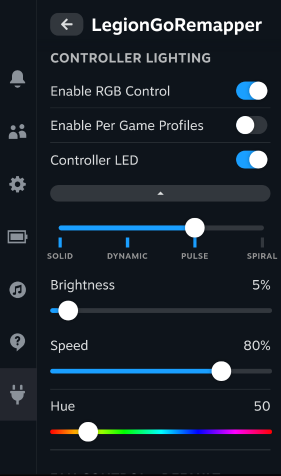
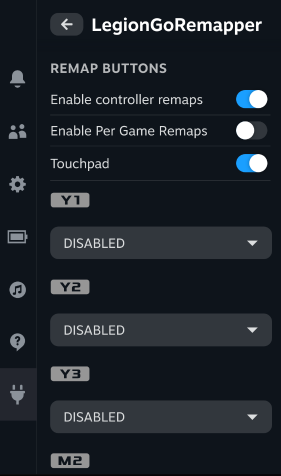

# Legion Go Remapper - Decky Plugin

Decky Plugin that replicates some of the Legion Space remapping functionality.





## Functionality

### This plugin uses the Lenovo-built remapping functionality that's used for Legion Space, which means that this plugin can only do what Legion Space is capable of

This remapping plugin also only covers remapping for the X-input mode of the controller, it does NOT support FPS mode or D-input modes.

Included Functionality in this plugin:

- Manage RBG lights, including modes, brightness, cycle speed for certain modes, and RGB light color
- Back Button Remapping for Y1, Y2, Y3, M2, M3 (M1 is not supported)
- Enabling/Disabling the touchpad
- Gyro remapping to Left or Right Control Stick
- allow any of these settings on a per-game basis

## Install Instructions

### Quick install

Run the following in terminal, then reboot

```
curl -L https://github.com/aarron-lee/LegionGoRemapper/raw/main/install.sh | sh
```

### Manual Install

add Udev rules to your device.

Create a file at `/etc/udev/rules.d/90-legion-go-remapper.rules`, and add the following to the file:

```
# allow r/w access by all local/physical sessions (seats)
# https://github.com/systemd/systemd/issues/4288
SUBSYSTEMS=="usb", ATTRS{idVendor}=="17ef", TAG+="uaccess"

# allow r/w access by users of the plugdev group
SUBSYSTEMS=="usb", ATTRS{idVendor}=="17ef", GROUP="plugdev", MODE="0660"

# allow r/w access by all users
SUBSYSTEMS=="usb", ATTRS{idVendor}=="17ef", MODE="0666"
```

After saving the file, then run `sudo udevadm control --reload` in terminal.

Download the latest release from the [releases page](https://github.com/aarron-lee/LegionGoRemapper/releases)

Unzip the `tar.gz` file, and move the `LegionGoRemapper` folder to your `$HOME/homebrew/plugins` directory

then run:

```
sudo systemctl restart plugin_loader.service
```

then reboot your machine.

## Manual Build

- Node.js v16.14+ and pnpm installed

```bash
git clone https://github.com/aarron-lee/LegionGoRemapper.git

cd LegionGoRemapper

# if pnpm not already installed
npm install -g pnpm

pnpm install
pnpm update decky-frontend-lib --latest
pnpm run build
```

Afterwards, you can place the entire `LegionGoRemapper` folder in the `~/homebrew/plugins` directly, then restart your plugin service

```bash
sudo systemctl restart plugin_loader.service

sudo systemctl reboot
```

## Attribution

Special thanks to [antheas](https://github.com/antheas) for [reverse engineering and documenting the HID protocols](https://github.com/antheas/hwinfo/tree/master/devices/legion_go/peripherals) for the Legion Go Controllers.

Also special thanks to [cornando98](https://github.com/corando98) for writing + testing the backend functions for talking to the HID devices, as well as contributing to the RGB light management code on the frontend.

Icon and controller button SVG files generated from PromptFont using FontForge.

> PromptFont by Yukari "Shinmera" Hafner, available at https://shinmera.com/promptfont
