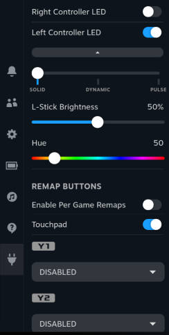
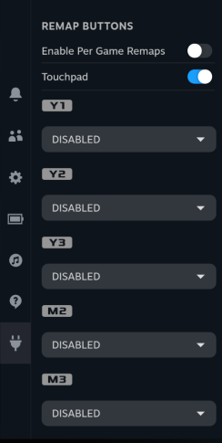

# Legion Go Remapper - Decky Plugin

[](https://github.com/aarron-lee/LegionGoRemapper/releases)

Decky Plugin that replicates some of the Legion Space remapping functionality.

- [Functionality](#functionality)
- [Install Instructions](#install-instructions)
  - [Prerequisites](#prerequisites)
  - [Quick Install / Update](#quick-install--update)
  - [Manual Install](#manual-install)
- [Manual Build](#manual-build)
- [Experimental Features](#experimental-features)
  - [Custom Fan Curves](#custom-fan-curves)
    - [Setup Instructions](#fan-curve-setup-instructions)
- [Troubleshooting/FAQ](#troubleshooting--frequently-asked-questions)
  - [LED management seems to work temporarily](#led-management-seems-to-work-temporarily)
  - [Can I turn off the power LED light while the device is asleep?](#can-i-turn-off-the-power-led-while-the-device-is-asleep)
  - [Can I set the RGB Lights separately?](#can-i-set-rgb-leds-separately-between-the-left-and-right-leds)
- [Attribution](#attribution)






# Functionality

### This plugin uses the Lenovo-built remapping + bios functionality that's used for Legion Space, which means that this plugin can only do what Legion Space is capable of

This remapping plugin also only covers remapping for the X-input mode of the controller, it does NOT support FPS mode or D-input modes.

Included Functionality in this plugin:

- Manage RBG lights, including modes, brightness, cycle speed for certain modes, and RGB light color
- Back Button Remapping for Y1, Y2, Y3, M2, M3 (M1 is not supported)
- Enabling/Disabling the touchpad
- Gyro remapping to Left or Right Control Stick
- allow any of these settings on a per-game basis
- (requires acpi_call) 80% charge limit toggle and custom fan curves

# Install Instructions

### Prerequisites

Decky Loader must already be installed.

### Quick Install / Update

Run the following in terminal, then reboot. Note that this works both for installing or updating the plugin

```
curl -L https://github.com/aarron-lee/LegionGoRemapper/raw/main/install.sh | sh
```

### Manual Install

add Udev rules to your device.

Create a file at `/etc/udev/rules.d/90-legion-go-remapper.rules`, and add the following to the file:

```
# allow r/w access by all local/physical sessions (seats)
# https://github.com/systemd/systemd/issues/4288
SUBSYSTEMS=="usb", ATTRS{idVendor}=="17ef", TAG+="uaccess"

# allow r/w access by users of the plugdev group
SUBSYSTEMS=="usb", ATTRS{idVendor}=="17ef", GROUP="plugdev", MODE="0660"

# allow r/w access by all users
SUBSYSTEMS=="usb", ATTRS{idVendor}=="17ef", MODE="0666"
```

After saving the file, then run `sudo udevadm control --reload` in terminal.

Download the latest release from the [releases page](https://github.com/aarron-lee/LegionGoRemapper/releases)

Unzip the `tar.gz` file, and move the `LegionGoRemapper` folder to your `$HOME/homebrew/plugins` directory

then run:

```
sudo systemctl restart plugin_loader.service
```

then reboot your machine.

# Manual Build

- Node.js v16.14+ and pnpm installed

```bash
git clone https://github.com/aarron-lee/LegionGoRemapper.git

cd LegionGoRemapper

# if pnpm not already installed
npm install -g pnpm

pnpm install
pnpm update decky-frontend-lib --latest
pnpm run build
```

Afterwards, you can place the entire `LegionGoRemapper` folder in the `~/homebrew/plugins` directly, then restart your plugin service

```bash
sudo systemctl restart plugin_loader.service

sudo systemctl reboot
```

# Experimental Features

### Custom Fan Curves

### WARNING: If you don't properly cool your device, it can go into thermal shutdown! Make sure you set proper fan curves to keep your device cool!

Note that this is using the fan curve implementation in the Legion Go's bios. This may require additional bios update from Lenovo to become fully functional.

This method must be manually enabled. Once enabled, will use Lenovo's bios WMI functions to set fan curves. Requires Bios v28 or newer.

Note that this requires the `acpi_call` module, if your Linux distro doesn't have it pre-installed, it'll have to be manually installed.

Special thanks to [corando98](https://github.com/corando98) for investigating fan curves + writing the functions for to control it.

run `sudo modprobe acpi_call` in terminal, if this errors out, you need to install `acpi_call`

# Troubleshooting / Frequently Asked Questions

## LED management seems to work temporarily

If you are using HHD for your controller, it has it's own LED management that overwrites this plugin.

Disable the LED management in HHD if you want to use LEDs via LegionGoRemapper instead.

## Can I turn off the power LED while the device is asleep?

Unfortunately, unless Lenovo enables configuring the sleep behavior of the LED via a bios update, this is not possible.

## Can I set RGB LEDs separately between the Left and Right LEDs?

Due to a controller firmware update, Lenovo disabled the ability to set the LEDs separately.

If you are on the latest firmware, the plugin will update both LEDs.

## The Plugin isn't working

First try reinstalling or updating the plugin to the latest version, there's an update button at the bottom of the plugin. You can also re-run the installer to update:

```
curl -L https://github.com/aarron-lee/LegionGoRemapper/raw/main/install.sh | sh
```

If this doesn't fix your issue, next try deleting your `$HOME/homebrew/settings/LegionGoRemapper/settings.json` file, and rebooting.

If neither works, please create a github issue.

# Attribution

Special thanks to [antheas](https://github.com/antheas) for [reverse engineering and documenting the HID protocols](https://github.com/antheas/hwinfo/tree/master/devices/legion_go) for the Legion Go Controllers, etc.

Also special thanks to [corando98](https://github.com/corando98) for writing + testing the backend functions for talking to the HID devices, investigating fan curves, as well as contributing to the RGB light management code on the frontend.

Icon and controller button SVG files generated from PromptFont using FontForge.

> PromptFont by Yukari "Shinmera" Hafner, available at https://shinmera.com/promptfont
